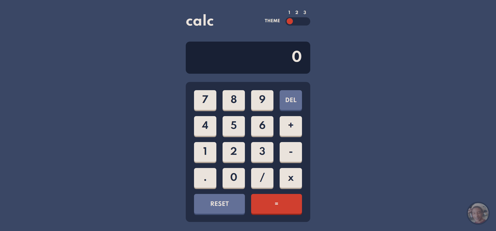

# 🧮 Calculator app


## Table of contents

- [Overview](#overview)
  - [The challenge](#the-challenge)
  - [Screenshot](#screenshot)
  - [Links](#links)
- [My process](#my-process)
  - [Built with](#built-with)
  - [What I learned](#what-i-learned)
  - [Useful resources](#useful-resources)
- [Author](#author)

## Overview

### The challenge

Users should be able to:

- See the size of the elements adjust based on their device's screen size
- Perform mathmatical operations like addition, subtraction, multiplication, and division
- Adjust the color theme based on their preference
- **Bonus**: Have their initial theme preference checked using `prefers-color-scheme` and have any additional changes saved in the browser

### Screenshot



### Links

- Website URL: [Click here](https://nick-gabe.github.io/calculator-website/)

## My process

At the start I had 3 themes, and it was really hard to think in a way of scripting that color change in a simplistic manner. I ended up by creating a class for every type of element, `type1` for the color of the header and the result text, `type2` for the buttons with numbers, `type3` for the buttons with text and `type4` for the "=" button.

With that I made a color palette array in Javascript, storing each palette as an item and creating the code of the theme slider to change between them.

But the hardest part was doing the calculator system work, I didn't wanted to use `eval()` and doing an alternative was painful and took some hours. But after that, the project was almost done and the last thing I did was adding animations to the buttons, a simple but cool touch :).

The Html and Css aren't too special, for the Html every button is a button, and the theme slider is a div with a button too. And I just used grid in the buttons and flex in the header. I also made that "credits" bubble in the end, but it is quite simple.

### Built with

- Semantic HTML5 markup
- Scss
- Flexbox
- CSS Grid
- Mobile-first workflow
- Event-Listeners
- Regex
- JavaScript

### What I learned

I learned one way to switch between customizable themes, a bit more advanced regex that i'm not used to:
```javascript
if (text.match(/(\+|\-|\*|\/)./g)) {
    doc.screen.textContent = Function(`return ${text}`)() + x

    changeFontSize(doc.screen.textContent)
}
```
How the `Function` *(not "function")* works and a lot of stuff.

### Useful resources

- [Pointer Events](https://developer.mozilla.org/en-US/docs/Web/API/Pointer_events) - Helped to make the calculator clickable by a mouse and a touchscreen.
- [Regex](https://developer.mozilla.org/en-US/docs/Web/API/Pointer_events) - Useful in a lot of situations for string verifications.
- [eval vs. Function](https://www.educative.io/edpresso/eval-vs-function-in-javascript#:~:text=An%20alternative%20to%20eval%20is,you%20that%20you%20can%20call.) - An alternative for eval().

## Author

- Frontend Mentor - [@Nick-Gabe](https://www.frontendmentor.io/profile/Nick-Gabe)
- CodePen - [@Nick-Gabe](https://codepen.io/nick-gabe)
- GitHub - [@Nick-Gabe](https://github.com/Nick-Gabe/)
- Twitter - [@MyNickIsNick_](https://www.twitter.com/MyNickIsNick_)